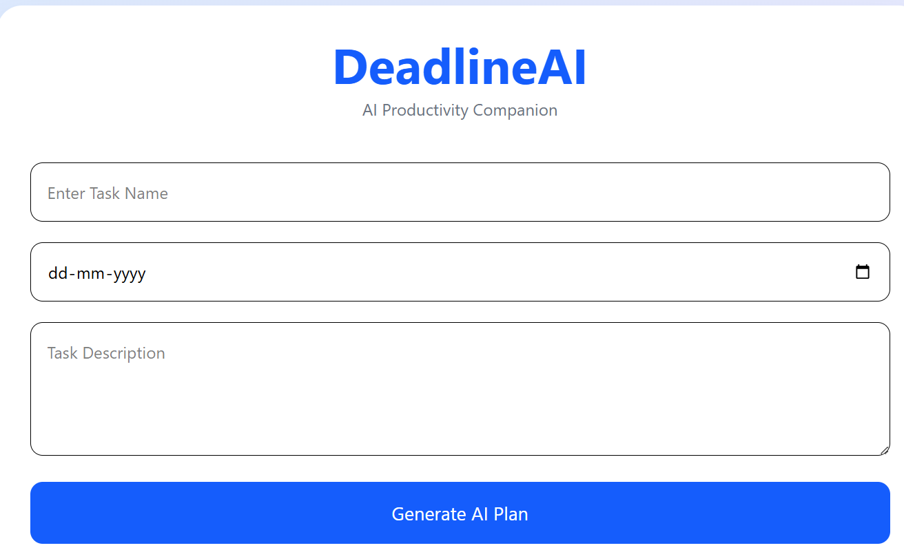
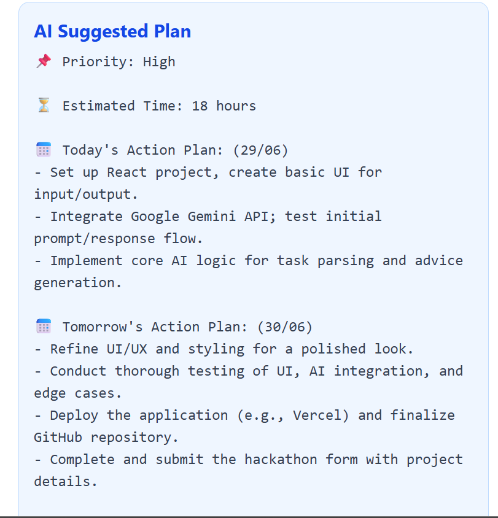
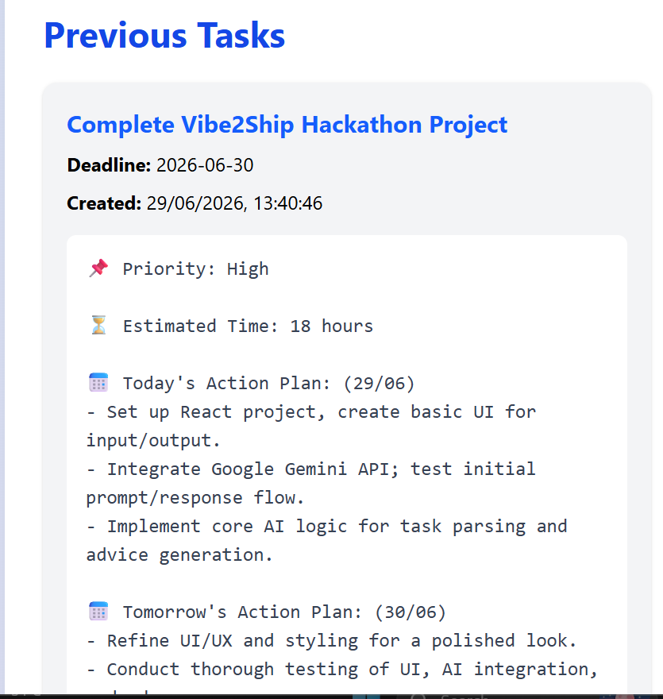

### 🚀 DeadlineAI – AI Productivity Companion

DeadlineAI is an AI-powered productivity assistant that helps users organize tasks, generate intelligent action plans, prioritize work, and improve time management using Google's Gemini AI.

Built for the **Vibe2Ship Hackathon 2026**, the application leverages Google AI technologies to transform simple task inputs into personalized productivity plans.

---

## 🌐 Live Demo

🔗 https://deadlineai-anusha.web.app

---

## 💻 GitHub Repository

🔗 https://github.com/MrsRathode/DeadlineAI

---

# 📌 Problem Statement

Managing multiple deadlines and planning tasks efficiently is challenging for students and professionals.

DeadlineAI solves this problem by generating AI-powered task plans that help users:

- Prioritize tasks
- Plan work efficiently
- Reduce procrastination
- Improve productivity
- Meet deadlines successfully

---

# ✨ Features

✅ AI-powered task planning

✅ Smart priority prediction

✅ Estimated completion time

✅ Step-by-step action plan

✅ Daily work schedule

✅ Productivity recommendations

✅ Risk analysis

✅ Final AI advice

✅ Task history

✅ Local storage support

✅ Responsive modern UI

---
#🎯 Why DeadlineAI?

- Helps users stay organized.
- Uses AI to create personalized task plans.
- Improves productivity and time management.

---
# 🛠 Tech Stack

### Frontend

- React.js
- Vite
- JavaScript
- CSS

### AI

- Google Gemini 2.5 Flash
- Google GenAI SDK

### Deployment

- Firebase Hosting
- Google Cloud

### Version Control

- Git
- GitHub

---

# ☁ Google Technologies Used

- Google Gemini API
- Google AI Studio
- Firebase Hosting
- Google Cloud Platform

---

# 📂 Project Structure

```
DeadlineAI
│
├── public
├── src
│   ├── App.jsx
│   ├── gemini.js
│   ├── index.css
│   └── main.jsx
│
├── package.json
├── vite.config.js
└── README.md
```

---

# ⚙ Installation

Clone the repository

```bash
git clone https://github.com/MrsRathode/DeadlineAI.git
```

Move into the project

```bash
cd DeadlineAI
```

Install dependencies

```bash
npm install
```

Create a `.env` file

```env
VITE_GEMINI_API_KEY=YOUR_GEMINI_API_KEY
```

Run the application

```bash
npm run dev
```

Build the project

```bash
npm run build
```

---

# 🚀 Deployment

The application is deployed using **Firebase Hosting**.

Deploy command:

```bash
firebase deploy
```

---

# 📸 Screenshots

## 🏠 Home Page



---

## 🤖 AI Generated Plan



---

## 📋 Task History




## Home Page

- Task Input Form
- AI Plan Generator
- Modern Responsive Interface

## AI Generated Plan

- Priority
- Estimated Time
- Daily Schedule
- Productivity Tips
- Risks
- Final Advice

---

# 🎯 Future Enhancements

- User Authentication
- Google Calendar Integration
- Email Reminders
- Notification System
- AI Chat Assistant
- Progress Analytics Dashboard
- Team Collaboration
- Voice Assistant

---

# 👩‍💻 Developer

**Banothu Anusha**

B.Tech – Electronics and Communication Engineering

Indian Institute of Information Technology Bhagalpur

GitHub:
https://github.com/MrsRathode

---

# 📄 License

This project was developed for educational and hackathon purposes.

---

# ⭐ Acknowledgements

- Google AI Studio
- Google Gemini API
- Firebase
- React
- Vite
- Vibe2Ship Hackathon 2026

---

## 🌟 If you like this project, don't forget to give it a ⭐ on GitHub!
